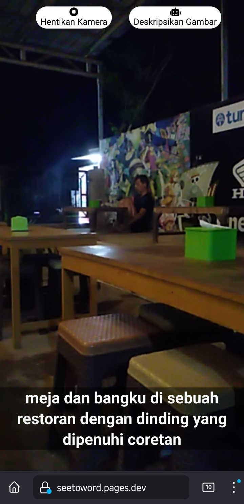

# SeeToWord

Website repository for [SeeToWord](https://seetoword.pages.dev).

## Project Setup

Create a `.env` file in the root directory with the following content:

```
VITE_COGNITIVE_SERVICE_KEY=<YOUR_AZURE_COGNITIVE_SERVICE_KEY>
VITE_COGNITIVE_SERVICE_ENDPOINT=<YOUR_AZURE_COGNITIVE_SERVICE_ENDPOINT>
VITE_COGNITIVE_SERVICE_LOCATION=<YOUR_AZURE_COGNITIVE_SERVICE_LOCATION>
VITE_BLOB_SERVICE_SAS_URL=<YOUR_AZURE_BLOB_SERVICE_SAS_URL>
```

### Install Dependencies

```sh
npm install
```

### Compile and Hot-Reload for Development

```sh
npm run dev
```

### Compile and Minify for Production

```sh
npm run build
```

## Screenshot

